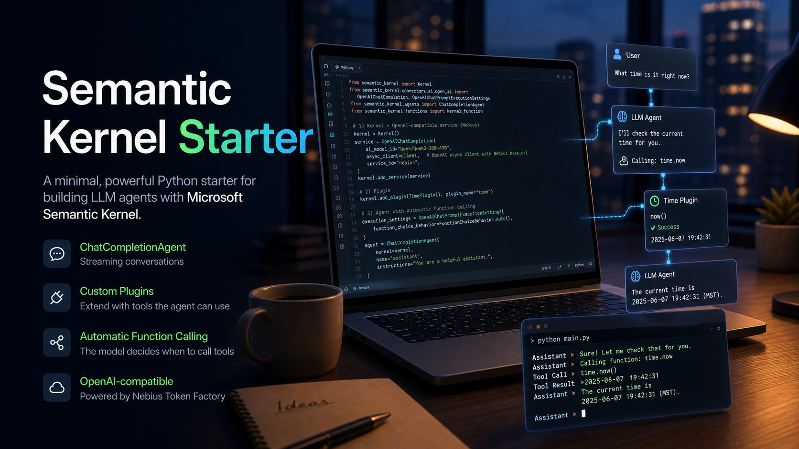

# Semantic Kernel Starter



A minimal, readable starter for building an agentic Python app with
[Microsoft Semantic Kernel](https://learn.microsoft.com/en-us/semantic-kernel/overview/).
It wires a `ChatCompletionAgent` to Nebius Token Factory through Semantic
Kernel's OpenAI-compatible connector, adds a custom plugin, and streams the
assistant response directly in the terminal.

This repository is designed for developers who want to understand the smallest
useful version of an LLM agent that can decide when to call a tool.

## Live Website

[View the published website](https://tirth1263.github.io/semantic-kernel-starter/)

## Why This Starter Exists

Most AI agent examples either hide the orchestration details or include more
infrastructure than you need for a first working build. This starter keeps the
surface area intentionally small:

- one Semantic Kernel `Kernel`
- one `ChatCompletionAgent`
- one OpenAI-compatible Nebius chat service
- one custom `TimePlugin`
- one terminal chat loop with streaming output

From there, you can add more plugins, swap models, introduce memory, or build a
web/API layer without first untangling a large demo app.

## Features

- **ChatCompletionAgent with streaming invocation** - responses are printed as
  they arrive instead of waiting for the full completion.
- **Custom TimePlugin** - demonstrates `@kernel_function` with a simple
  `time.now` function.
- **Automatic function calling** - the model can decide when the time plugin is
  useful and Semantic Kernel can invoke it automatically.
- **Nebius Token Factory support** - uses an `openai.AsyncOpenAI` client with a
  custom `base_url`, then passes it into Semantic Kernel's `OpenAIChatCompletion`
  connector.
- **Clean environment configuration** - all provider-specific values live in
  `.env`.

## Tech Stack

- Python 3.10+
- `semantic-kernel` 1.x
- `openai` Python SDK
- Nebius Token Factory OpenAI-compatible API
- Model: `Qwen/Qwen3-30B-A3B` by default

## Project Structure

```text
.
├── main.py
├── requirements.txt
├── semantic_kernel_starter/
│   ├── agent.py
│   ├── config.py
│   └── plugins/
│       └── time_plugin.py
├── tests/
│   └── test_time_plugin.py
└── website/
    ├── index.html
    ├── styles.css
    ├── script.js
    └── assets/
        └── hero.png
```

## Prerequisites

- Python 3.10 or newer
- A Nebius API key from [Nebius Token Factory](https://studio.nebius.ai/)

## Installation

```bash
git clone https://github.com/tirth1263/semantic-kernel-starter.git
cd semantic-kernel-starter

pip install -r requirements.txt
# or: uv pip install -r requirements.txt
```

Create `.env`:

```bash
cp .env.example .env
# set NEBIUS_API_KEY
```

Example `.env`:

```env
NEBIUS_API_KEY=your_nebius_api_key_here
NEBIUS_BASE_URL=https://api.tokenfactory.nebius.com/v1/
NEBIUS_MODEL=Qwen/Qwen3-30B-A3B
DEFAULT_TIMEZONE=America/Phoenix
TEMPERATURE=0.6
MAX_TOKENS=1000
```

## Usage

Start the interactive chat:

```bash
python main.py
```

Or send a one-shot prompt:

```bash
python main.py "What time is it right now?"
```

Example queries:

- "What time is it right now?" - triggers the `time.now` plugin.
- "Give me three ideas for an AI side project."
- "Explain semantic kernels in one paragraph."

## How It Works

`semantic_kernel_starter/agent.py` builds the agent in four steps:

1. Create a Semantic Kernel `Kernel`.
2. Create an `openai.AsyncOpenAI` client with the Nebius Token Factory
   `base_url`.
3. Register that client through Semantic Kernel's `OpenAIChatCompletion`
   connector.
4. Add `TimePlugin` and enable `FunctionChoiceBehavior.Auto()`.

When a prompt needs the current time, the model can select `time.now`, Semantic
Kernel invokes the function, and the final assistant response streams back to
the terminal.

## Customizing the Starter

### Change the model

Update `NEBIUS_MODEL` in `.env`.

```env
NEBIUS_MODEL=Qwen/Qwen3-30B-A3B
```

### Change the default timezone

```env
DEFAULT_TIMEZONE=Asia/Kolkata
```

### Add another plugin

Create a class with `@kernel_function` methods and register it in
`semantic_kernel_starter/agent.py`:

```python
kernel.add_plugin(MyPlugin(), plugin_name="my_plugin")
```

## Testing

The included test covers the custom plugin without calling Nebius:

```bash
python -m unittest discover -s tests -v
```

## Notes

- Keep `.env` local. Never commit real API keys.
- Some models and accounts may expose different model IDs in Nebius Token
  Factory. If your selected model is unavailable, update `NEBIUS_MODEL`.
- Tool calling depends on model support for OpenAI-compatible tool/function
  calls.

## License

MIT
